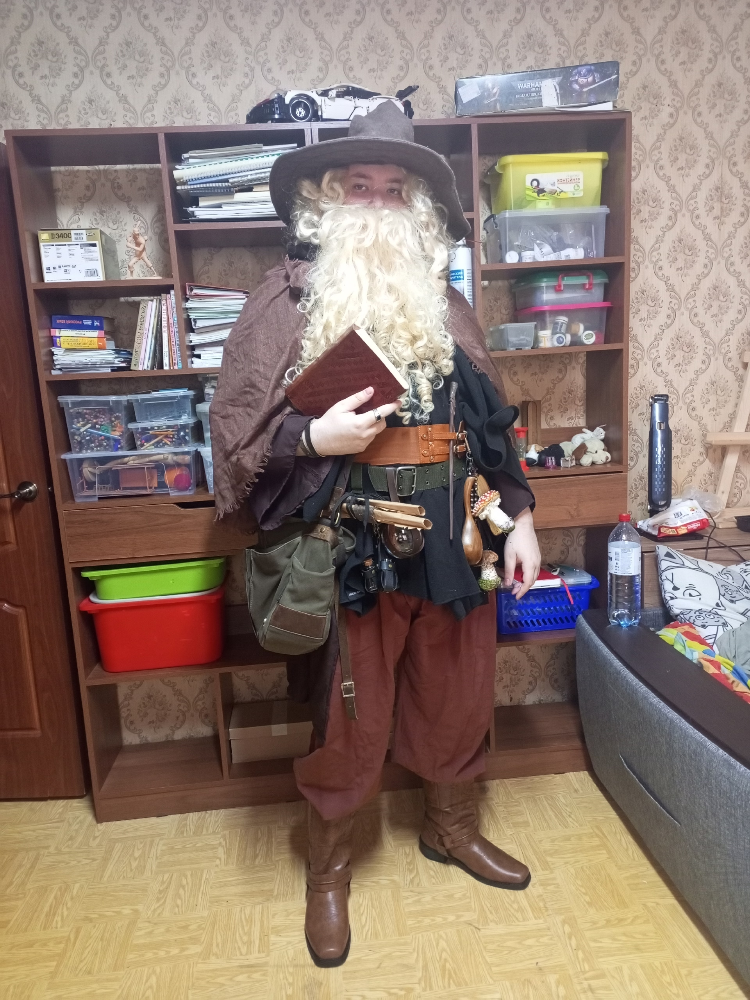
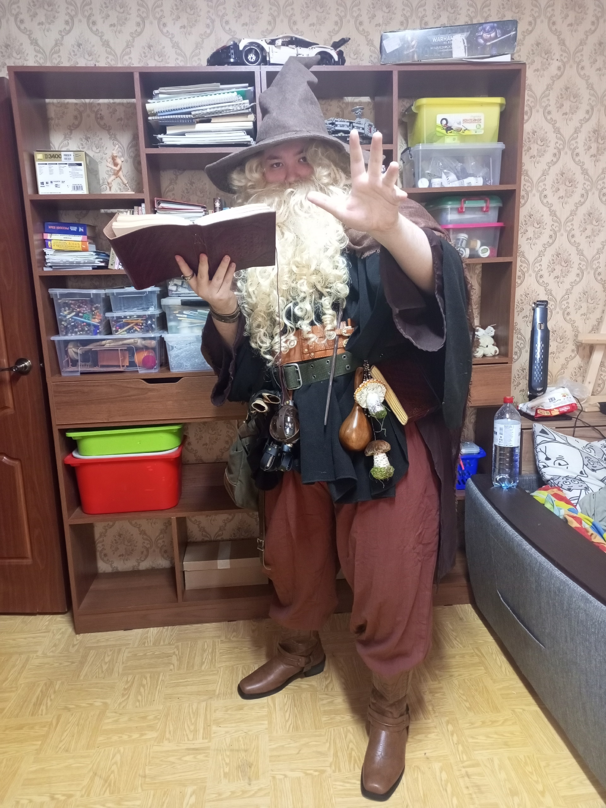
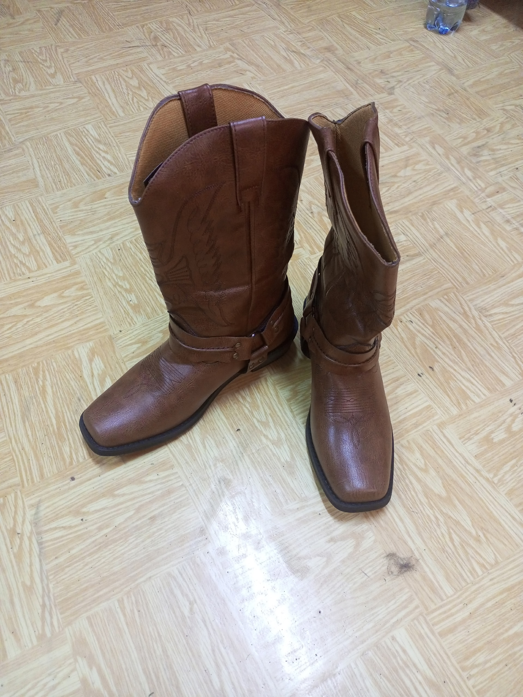
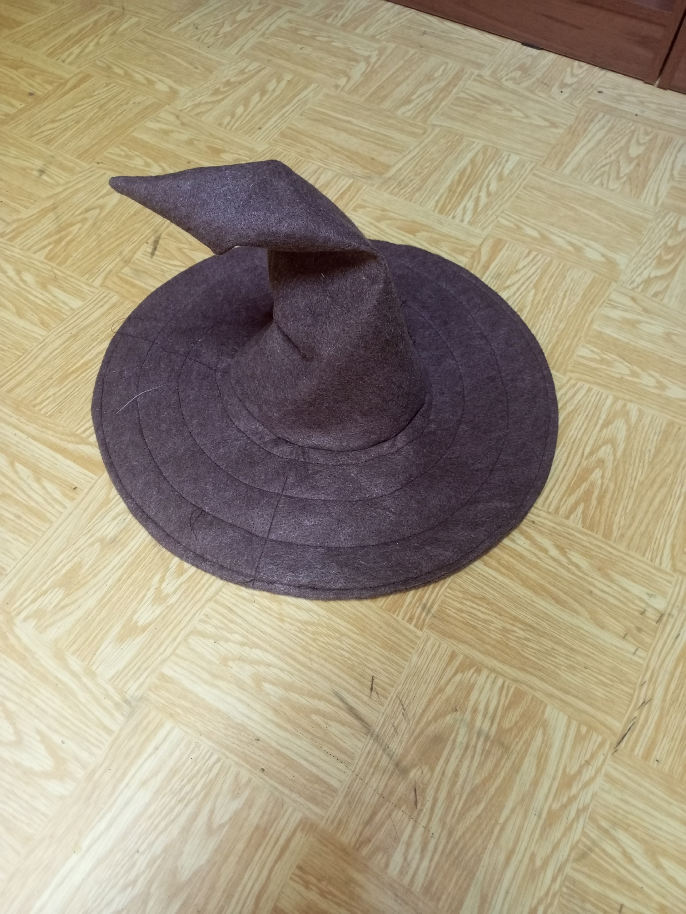

# How it looks like

---

# Why I made it

I love cosplay. But when I tried to come to a festival in a cosplay of a mercenary from "S.T.A.L.K.E.R.", 
I was kicked out because tactical elements were prohibited (I should have read the rules more carefully).

So, I decided to do something classic. Dungeons & Dragons immediately came to mind. 
After looking at different cosplays online, I realized exactly what I wanted.

That's how I decided to create the look of a classic wizard, but with a modern take on clothing design.

---

# How I made it

I started with the basics. I used a cheap robe as a base for later upgrades. Then, a black poncho went over it. It became the foundation of the overall look. Over that, I added a belt and a harness with various decorations and props. Over everything, I put an old cloak.

For the lower body, I took simple harem pants and Cossack boots, which complemented the look well.

The most important part — the head — was the most interesting. Not counting the cheap beard (which nevertheless carries the look), I made the hat myself, using my own pattern.

And that's how it came together.

---

# Future

I plan to wear this to the upcoming cosplay and fantasy festival — Epic Con Russia. There, it will truly shine.

My next post will be from there.

Thats it, fellas.

---

---
